# AI Preparation Coach — Architecture

> **Version**: 0.1.0 · **Framework**: Next.js 16 (App Router) · **Language**: TypeScript

---

## 1. High-Level System Architecture

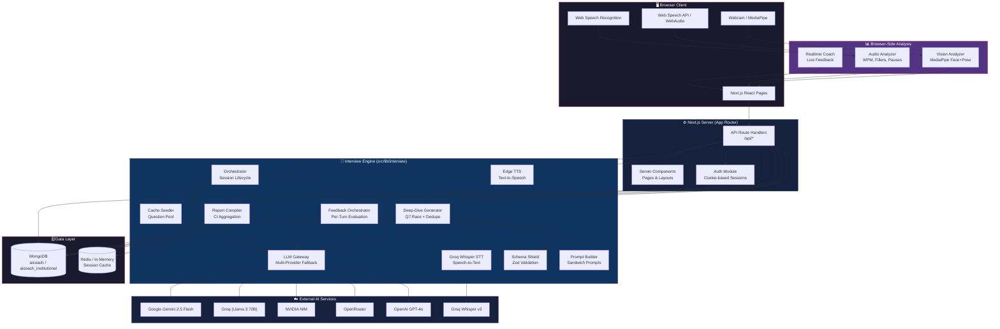

---

## 2. Interview Session Lifecycle (State Machine)

The session progresses through a strict, forward-only state machine. No backward or same-state transitions are permitted.

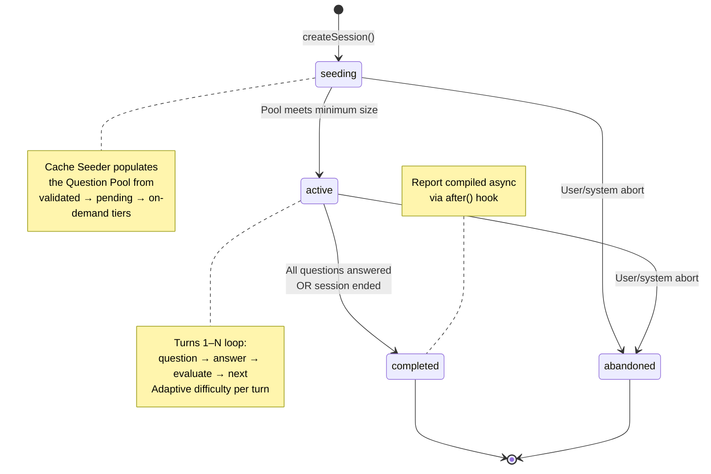

---

## 3. Interview Turn Flow (Turns 1–7+)

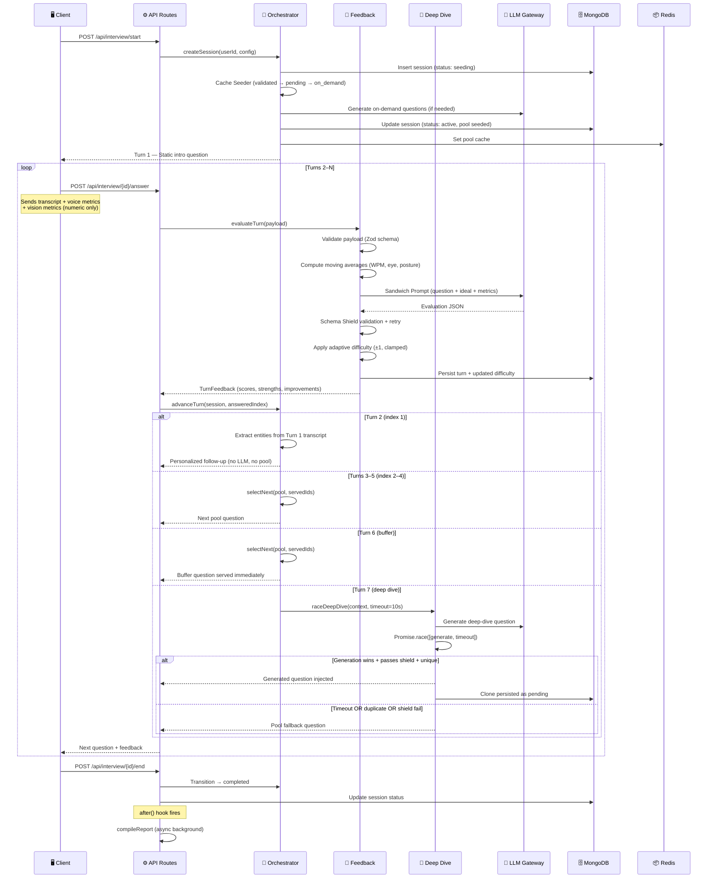

---

## 4. LLM Gateway — Multi-Provider Fallback Chain

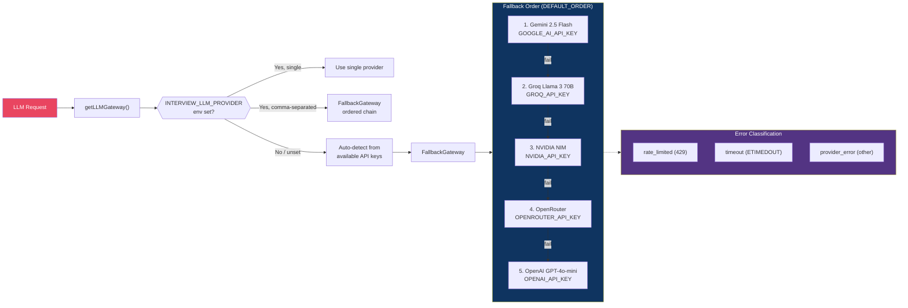

> [!NOTE]
> The `mock` provider is available for offline testing (`INTERVIEW_LLM_PROVIDER=mock`). It returns deterministic, schema-valid JSON without any network call.

---

## 5. Multimodal Analysis Pipeline

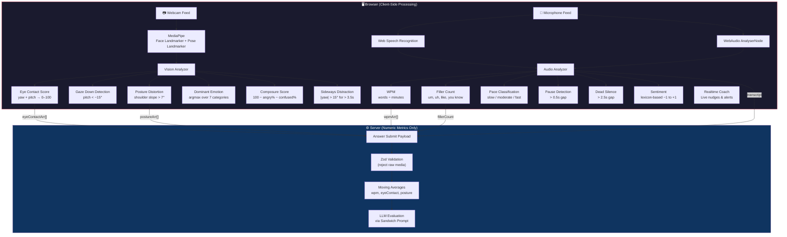

> [!IMPORTANT]
> **Privacy by Design (Req 15)**: Raw audio and video NEVER leave the browser. Only numeric metric arrays and text transcripts are sent to the server. The sole exception is the Groq Whisper STT transcription endpoint, where audio is forwarded transiently and not persisted.

---

## 6. Data Model (MongoDB Collections)

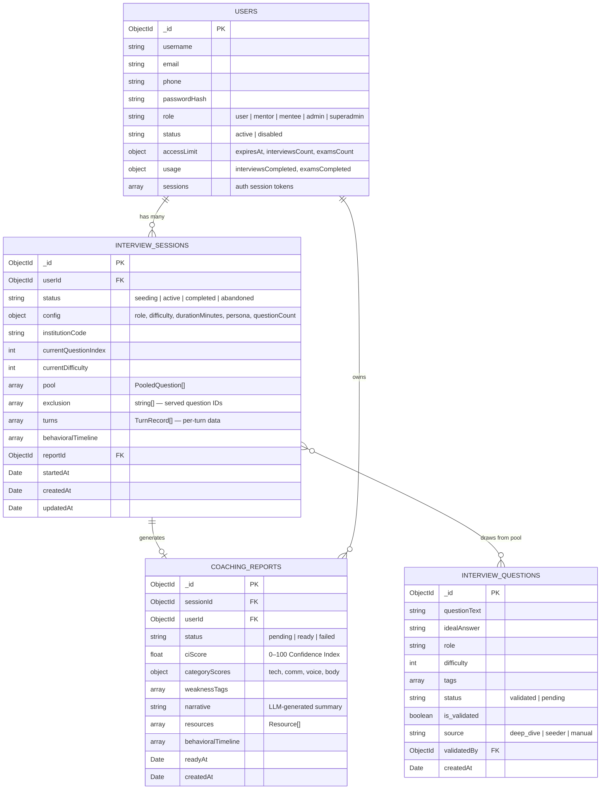

### Redis Cache Schema

| Key Pattern | Value | TTL |
|---|---|---|
| `interview:session:{id}:pool` | `PoolCache` (pool, exclusion, index, difficulty) | 2 hours |
| `interview:report:{id}:status` | `{ status }` | 2 hours |

> [!TIP]
> Redis is optional — the `RedisClient` class gracefully falls back to an in-memory `Map`-based cache when `REDIS_URL` is not configured.

---

## 7. Authentication & Authorization Flow

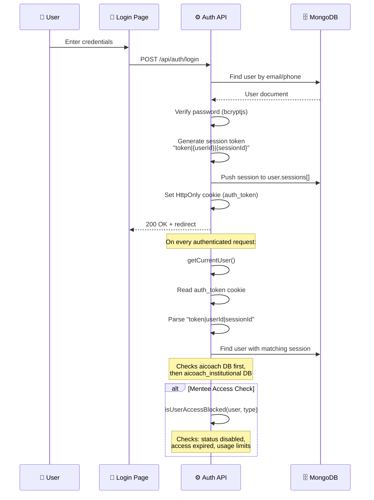

### Role Hierarchy

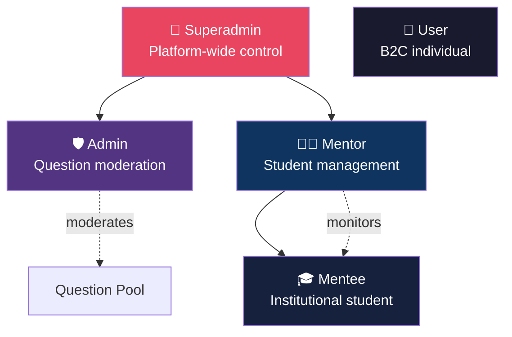

---

## 8. Report Compilation Pipeline

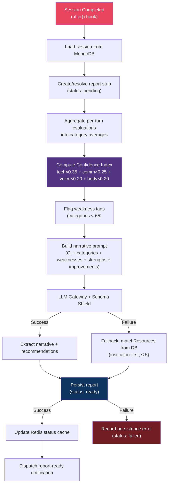

### CI Score Formula

$$\text{CI} = \text{Technical Accuracy} \times 0.35 + \text{Communication} \times 0.25 + \text{Voice CI} \times 0.20 + \text{Body CI} \times 0.20$$

---

## 9. Question Pool Seeding Strategy

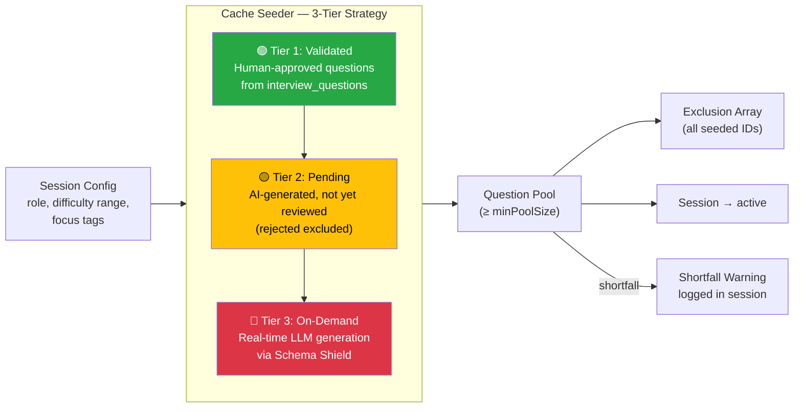

---

## 10. Adaptive Difficulty Engine

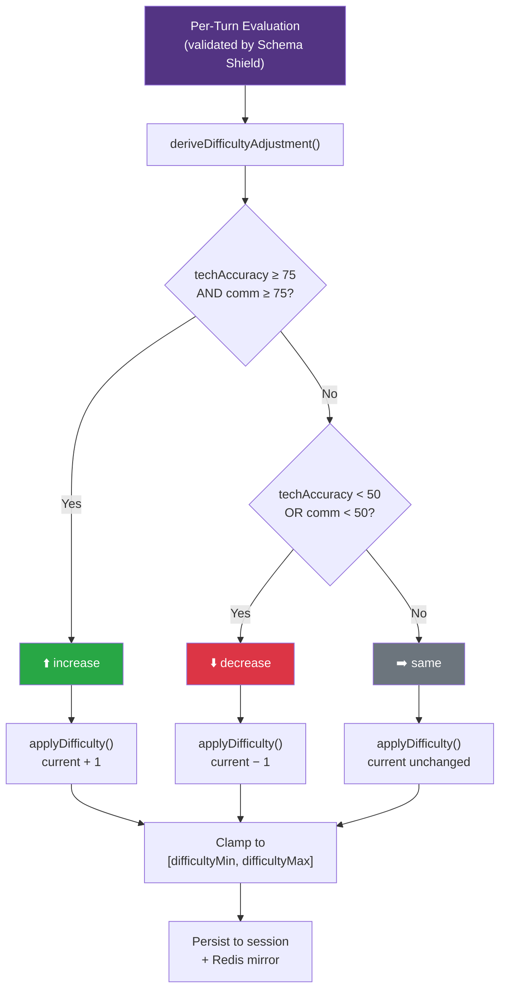

> [!NOTE]
> The difficulty signal is derived **deterministically** from evaluation scores, not from the LLM's self-reported `difficultyAdjustment` field, which was found to be unreliably always `'same'` (BUG 2 fix).

---

## 11. API Route Map

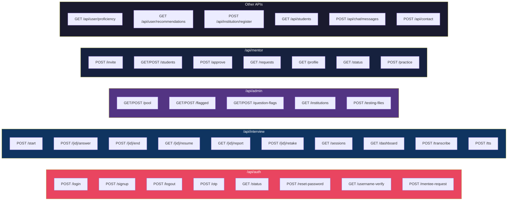

---

## 12. Frontend Page Architecture

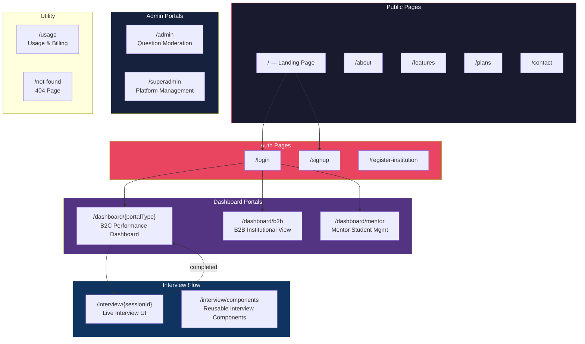

---

## 13. Directory Structure

```
f:\project\aicoach\
├── src/
│   ├── app/                          # Next.js App Router
│   │   ├── api/                      # API Route Handlers
│   │   │   ├── auth/                 # login, signup, logout, otp, status, reset-password
│   │   │   ├── interview/            # start, transcribe, tts, sessions, dashboard
│   │   │   │   └── [sessionId]/      # answer, end, report, resume, retake
│   │   │   ├── admin/                # pool, flagged, question-flags, institutions
│   │   │   ├── mentor/               # invite, students, approve, requests, profile
│   │   │   ├── chat/messages/        # In-app messaging
│   │   │   ├── contact/              # Contact form
│   │   │   ├── institution/register/ # B2B institution registration
│   │   │   ├── user/                 # proficiency, recommendations
│   │   │   └── students/             # Student listing
│   │   ├── components/               # Shared UI components
│   │   │   └── ui/                   # Base UI primitives
│   │   ├── interview/                # Interview session pages
│   │   │   ├── [sessionId]/          # Live interview page
│   │   │   └── components/           # Interview-specific components
│   │   ├── dashboard/                # Dashboard pages
│   │   │   ├── [portalType]/         # B2C dynamic dashboard
│   │   │   ├── b2b/                  # Institutional dashboard
│   │   │   └── mentor/               # Mentor dashboard
│   │   ├── admin/                    # Admin panel
│   │   ├── superadmin/               # Superadmin panel
│   │   ├── login/ | signup/          # Auth pages
│   │   └── page.tsx                  # Landing page
│   │
│   ├── lib/                          # Core Business Logic
│   │   ├── interview/                # Interview Engine
│   │   │   ├── orchestrator.ts       # Session lifecycle, turn flow, state machine
│   │   │   ├── feedback.ts           # Per-turn evaluation, adaptive difficulty
│   │   │   ├── deep-dive.ts          # Q7 race, semantic dedupe, sliding window
│   │   │   ├── report.ts             # End-of-session report compilation
│   │   │   ├── llm-gateway.ts        # Multi-provider LLM with fallback chain
│   │   │   ├── cache-seeder.ts       # 3-tier question pool seeding
│   │   │   ├── session-store.ts      # MongoDB + Redis persistence
│   │   │   ├── schemas.ts            # Zod schemas for all data types
│   │   │   ├── schema-shield.ts      # LLM output validation with retry
│   │   │   ├── prompt-builder.ts     # Sandwich prompt construction
│   │   │   ├── dashboard-metrics.ts  # Dashboard aggregation (pure)
│   │   │   ├── groq-stt.ts           # Groq Whisper speech-to-text
│   │   │   ├── tts.ts                # Edge TTS text-to-speech
│   │   │   ├── notifier.ts           # Report-ready notifications
│   │   │   ├── resource-matcher.ts   # Resource matching for reports
│   │   │   ├── tier-gate.ts          # Feature gating by subscription tier
│   │   │   ├── duration.ts           # Duration → question count mapping
│   │   │   └── browser/              # Client-side analysis modules
│   │   │       ├── vision-analyzer.ts    # MediaPipe face + pose analysis
│   │   │       ├── audio-analyzer.ts     # Speech metrics (WPM, fillers, pauses)
│   │   │       ├── metrics.ts            # Pure metric math (moving average, etc.)
│   │   │       └── realtime-coach.ts     # Live coaching nudges
│   │   ├── dashboard-suite/          # Dashboard data layer
│   │   │   ├── types.ts              # Shared dashboard types
│   │   │   ├── report-payload.ts     # Report payload construction
│   │   │   ├── per-turn.ts           # Per-turn strengths/improvements
│   │   │   ├── cohort-metrics.ts     # B2B cohort aggregation
│   │   │   ├── recommendation.ts     # Resource recommendation engine
│   │   │   ├── poll-machine.ts       # Report status polling
│   │   │   ├── profile-validation.ts # Profile data validation
│   │   │   ├── timeline.ts           # Behavioral timeline
│   │   │   ├── access.ts             # Dashboard access control
│   │   │   ├── pdf-model.ts          # PDF report generation model
│   │   │   └── constants.ts          # Dashboard constants
│   │   ├── question-pool/            # Question selection
│   │   │   ├── question-selector.ts  # Selection algorithm
│   │   │   └── quality-gate.ts       # Question quality validation
│   │   ├── pool-warmer/              # Background pool warming
│   │   │   ├── warmer.ts             # Pool warming orchestrator
│   │   │   ├── generation-queue.ts   # Generation job queue
│   │   │   ├── gap-analyzer.ts       # Coverage gap detection
│   │   │   └── enhanced-prompt.ts    # Enhanced generation prompts
│   │   ├── proficiency/              # Skill proficiency tracking
│   │   │   ├── proficiency-engine.ts # Core proficiency calculations
│   │   │   ├── elo-calculator.ts     # ELO-based skill rating
│   │   │   └── decay-model.ts        # Skill decay over time
│   │   ├── auth.ts                   # Authentication helpers
│   │   ├── mongodb.ts                # MongoDB client singleton
│   │   ├── redis.ts                  # Redis client with in-memory fallback
│   │   ├── profile.ts                # User profile helpers
│   │   ├── assessment.ts             # Assessment utilities
│   │   └── taxonomy.ts               # Topic/skill taxonomy
│   │
│   ├── scripts/                      # Utility scripts
│   └── proxy.ts                      # Dev proxy configuration
│
├── testing/                          # Test infrastructure
├── md-files/                         # Project documentation
├── interview-section-details/        # Interview config details
├── vitest.config.ts                  # Vitest configuration
├── next.config.ts                    # Next.js configuration
├── package.json                      # Dependencies
└── tsconfig.json                     # TypeScript configuration
```

---

## 14. Technology Stack

| Layer | Technology | Purpose |
|---|---|---|
| **Framework** | Next.js 16 (App Router) | Full-stack React framework, SSR + API routes |
| **Language** | TypeScript 5 | Type-safe development |
| **UI** | React 19, Tailwind CSS 4, Lucide Icons | Component library & styling |
| **Database** | MongoDB 7 | Primary data store (users, sessions, reports, questions) |
| **Cache** | Redis (ioredis) / In-Memory fallback | Session pool cache, report status cache |
| **LLM — Primary** | Google Gemini 2.5 Flash | Question generation, answer evaluation, narratives |
| **LLM — Fallbacks** | Groq, NVIDIA NIM, OpenRouter, OpenAI | Multi-provider resilience chain |
| **Speech-to-Text** | Groq Whisper Large v3 | Verbatim audio transcription |
| **Text-to-Speech** | Microsoft Edge TTS | Question audio playback |
| **Computer Vision** | MediaPipe (Face + Pose Landmarker) | Eye contact, emotion, posture analysis |
| **Audio Analysis** | Web Speech API + WebAudio | WPM, filler words, pauses, sentiment |
| **Validation** | Zod 4 | Schema validation (input payloads + LLM output) |
| **Auth** | Cookie-based sessions + bcryptjs | Custom auth with session tokens |
| **PDF** | jsPDF | Report PDF generation |
| **Testing** | Vitest, fast-check | Unit tests + property-based testing |

---

## 15. Key Design Decisions

> [!IMPORTANT]
> **No raw media on the server** — All audio/video processing happens in the browser via MediaPipe and Web APIs. Only numeric arrays and transcripts cross the network boundary (Req 15).

> [!TIP]
> **Schema Shield pattern** — Every LLM response is validated through a Zod schema with automatic re-prompting (up to 3 retries). This ensures type-safe, structured AI output throughout the system.

> [!NOTE]
> **Dependency injection throughout** — All I/O operations (DB, LLM, time, ID generation) are injected via typed interfaces (`OrchestratorStore`, `FeedbackStore`, `DeepDiveStore`, etc.), enabling pure-function unit testing without mocks.

> [!NOTE]
> **Dual-database architecture** — B2C users are stored in `aicoach`, institutional users in `aicoach_institutional`. The `getInterviewDb()` function auto-selects based on the authenticated user's role.
