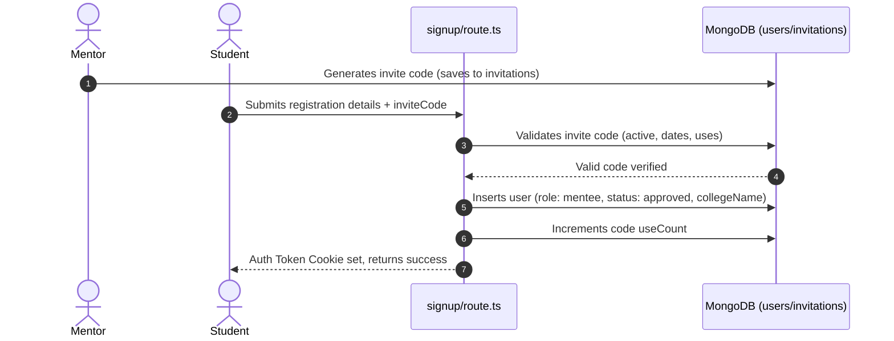

# Integration Plan: B2B Institutional (Mentor & Mentee) Feature Integration

This integration plan details how to import and integrate the B2B Institutional features from the prototype codebase [orchidsai-main](file:///F:/project/aicoach/orchidsai-main) into the main project [aicoach](file:///F:/project/aicoach).

---

## 1. Architectural & Core Tech Comparison

### 1.1 Tech Stack Differences
| Core Dimension | Prototype (`orchidsai-main`) | Main Project (`aicoach`) |
| :--- | :--- | :--- |
| **Routing / SSR** | Next.js 16 (App Router) | Next.js 16 (App Router) |
| **State & Guards** | Custom Context + localStorage, mock JWT | Next.js Server Actions, Cookies (`auth_token`), custom MongoDB lookup |
| **Auth System** | Better-Auth with mock DB wrappers | OTP-based phone/email sign-in (custom Redis + MongoDB session list) |
| **Database** | SQLite/LibSQL with Drizzle ORM | MongoDB (official driver `mongodb`) + Redis |
| **Charts** | Recharts (Area, Radar, Bar charts) | Dependency-free, custom SVG charts ([LineChart.tsx](file:///F:/project/aicoach/src/app/dashboard/b2c/components/charts/LineChart.tsx), [RadarChart.tsx](file:///F:/project/aicoach/src/app/dashboard/b2c/components/charts/RadarChart.tsx)) |
| **Animations** | `framer-motion`, `tailwindcss-animate`, `tw-animate-css` | CSS transitions, keyframes, Tailwind native classes |

> [!IMPORTANT]
> **Architectural Direction:**
> 1. **No New DB Engines:** We will not install SQLite, LibSQL, or Drizzle. All persistent schemas must map directly to MongoDB collections (`users`, `invitations`, `assigned_practices`, `messages`).
> 2. **Dependency-Free Charts:** Do not import `recharts` to the main project. Use and extend the main project's existing custom interactive SVG components [LineChart.tsx](file:///F:/project/aicoach/src/app/dashboard/b2c/components/charts/LineChart.tsx) and [RadarChart.tsx](file:///F:/project/aicoach/src/app/dashboard/b2c/components/charts/RadarChart.tsx) to render progress metrics.
> 3. **Consistent Auth:** Do not use `better-auth`. Keep the existing `getCurrentUser()` check in [auth.ts](file:///F:/project/aicoach/src/lib/auth.ts) and verify sessions against the MongoDB `users` collection.

---

## 2. Design System & Styling Integration

### 2.1 CSS Utility Mapping
The main project's [globals.css](file:///F:/project/aicoach/src/app/globals.css) already contains the necessary classes for neo-glassmorphic styling. We will maps prototype UI rules directly:
- **Containers:** Wrap dashboard items with `glass-card` and add interactivity using `glass-card-hover`.
- **Backgrounds:** Keep the global layout wrapped in a div with the `bg-grid` class.
- **Brand Colors:** Use `--color-amber` (`#fb923c`) for Mentee actions and `--color-emerald` (`#10b981`) or `--color-purple` (`#8b5cf6`) for Mentor navigation.
- **Ambient Glows:** Insert the existing `<AmbientGlow>` component at the top of pages for the signature AI-portal aesthetic.

---

## 3. Registration & Authentication Transition

### 3.1 Legacy Student Request vs. Secure Invite Code System
In the existing B2B setup:
1. Students request access by hitting `/api/auth/mentee-request` which creates a `pending` user.
2. Mentors manually review requests and approve them, generating a random password (`WelcomeXXXX`) that is simulated as sent to the student.
3. This is inefficient, poses delivery hurdles, and increases administrative overhead for mentors.

The new **Invite Code/Link System** simplifies this:
1. Mentors generate active invite codes (e.g. `INST-ABCD-1234`) mapped to their college.
2. Students sign up directly by going to `/signup?code=INST-ABCD-1234`.
3. The register API verifies the code, creates the user as `approved` immediately, links them to the institution, and lets the student choose their own credentials, bypassing the pending queue.



---

## 4. Database Schema Updates (MongoDB)

To support invite links, practice assignments, notes, and messaging, we will update the MongoDB database `aicoach` with the following structures:

### 4.1 `invitations` Collection
Stores institution invitation details.
- **Fields:**
  - `_id`: ObjectId
  - `code`: string (unique indexed, format `INST-XXXX-XXXX`)
  - `collegeName`: string
  - `createdBy`: ObjectId (ref to `users._id` of the mentor)
  - `createdAt`: Date
  - `expiresAt`: Date
  - `maxUses`: number | null
  - `useCount`: number
  - `status`: 'active' | 'expired' | 'revoked'

### 4.2 `assigned_practices` Collection
Maintains exercises assigned to mentees by mentors.
- **Fields:**
  - `_id`: ObjectId
  - `mentorId`: ObjectId (ref to `users._id`)
  - `menteeId`: ObjectId (ref to `users._id`)
  - `type`: 'technical' | 'hr' | 'mock' | 'exam'
  - `domain`: string
  - `dueDate`: Date | null
  - `createdAt`: Date
  - `status`: 'pending' | 'completed'

### 4.3 `messages` Collection
Maintains real-time chats between mentors and mentees.
- **Fields:**
  - `_id`: ObjectId
  - `senderId`: ObjectId (ref to `users._id`)
  - `recipientId`: ObjectId (ref to `users._id`)
  - `text`: string
  - `createdAt`: Date
  - `read`: boolean

### 4.4 `users` Collection Schema Extensions
Extend the existing B2B user document schema to support:
- `flagged`: boolean (default: false, allows mentors to mark students needing review)
- `notes`: string (private mentor notes, stored directly in the user document or loaded dynamically)

---

## 5. Backend API Endpoints (Next.js Route Handlers)

We need to implement the following route handlers inside `src/app/api`:

### 5.1 `POST /api/mentor/invite/generate`
Generates a new invitation link and code.
- **Request Headers:** Cookie: `auth_token`
- **Request Body:**
  ```json
  {
    "expiresDays": 30,
    "maxUses": 100
  }
  ```
- **Response Body (Success 201):**
  ```json
  {
    "message": "Invitation code created",
    "code": "INST-A9F2-K08C",
    "link": "/signup?code=INST-A9F2-K08C"
  }
  ```

### 5.2 `GET /api/mentor/invite`
Lists active invite links generated by the mentor.
- **Request Headers:** Cookie: `auth_token`
- **Response Body (Success 200):**
  ```json
  [
    {
      "code": "INST-A9F2-K08C",
      "createdAt": "2026-06-05T08:00:00Z",
      "expiresAt": "2026-07-05T08:00:00Z",
      "useCount": 14,
      "maxUses": 100,
      "status": "active"
    }
  ]
  ```

### 5.3 `POST /api/mentor/students/[id]/flag`
Toggle student flag status.
- **Request Headers:** Cookie: `auth_token`
- **Request Body:**
  ```json
  {
    "flagged": true
  }
  ```
- **Response Body (Success 200):**
  ```json
  { "message": "Student flag status updated" }
  ```

### 5.4 `POST /api/mentor/students/[id]/notes`
Saves private notes for a student.
- **Request Headers:** Cookie: `auth_token`
- **Request Body:**
  ```json
  {
    "notes": "Needs extra practice on recursion."
  }
  ```
- **Response (Success 200):**
  ```json
  { "message": "Mentor notes updated successfully" }
  ```

### 5.5 `POST /api/mentor/practice/assign`
Assigns practice to a student.
- **Request Headers:** Cookie: `auth_token`
- **Request Body:**
  ```json
  {
    "menteeId": "64b73...",
    "type": "technical",
    "domain": "Software Engineering",
    "dueDate": "2026-06-12T00:00:00Z"
  }
  ```
- **Response (Success 201):**
  ```json
  { "message": "Practice assigned successfully" }
  ```

### 5.6 `GET /api/students/practice/assigned`
For students to fetch tasks assigned by their mentor.
- **Request Headers:** Cookie: `auth_token`
- **Response (Success 200):**
  ```json
  [
    {
      "id": "practice-123",
      "type": "technical",
      "domain": "Software Engineering",
      "dueDate": "2026-06-12T00:00:00Z",
      "status": "pending"
    }
  ]
  ```

### 5.7 Chat Messages API (`/api/chat/messages`)
Handles messaging.
- **`GET /api/chat/messages?userId=[id]`**: Fetches messages history.
- **`POST /api/chat/messages`**: Sends a message to a recipient.
  - **Request Body:** `{ "recipientId": "userId", "text": "Hello!" }`

---

## 6. Frontend Pages Integration Plan

We will structure the integrated pages as follows in the Next.js router:

```
src/
└── app/
    └── dashboard/
        ├── mentor/                        ← Mentor Portal Root
        │   ├── layout.tsx                 ← Navigation Sidebar
        │   ├── page.tsx                   ← Enterprise Overview (Metrics, Batch lists)
        │   ├── students/
        │   │   └── page.tsx               ← Student Profiles & Actions (Notes, Flags, Chat)
        │   ├── analytics/
        │   │   └── page.tsx               ← Aggregated Analytics (Placeholder)
        │   └── invite/
        │       └── page.tsx               ← Invite Access Setup
        └── b2b/                           ← B2B Mentee Portal Root
            ├── layout.tsx                 ← Sidebar wrap
            ├── page.tsx                   ← B2B Dashboard (Aggregated stats, Assigned practice)
            └── (other routes...)
```

### 6.1 Mentor Portal Layout & Sidebar
Create [layout.tsx](file:///F:/project/aicoach/src/app/dashboard/mentor/layout.tsx):
- Wrap pages in the sidebar layout mirroring the style of the prototype [AdminSidebar.tsx](file:///F:/project/aicoach/orchidsai-main/src/components/AdminSidebar.tsx).
- Add navigation routes:
  1. `/dashboard/mentor` (Overview)
  2. `/dashboard/mentor/students` (Student Profiles)
  3. `/dashboard/mentor/analytics` (Analytics)
  4. `/dashboard/mentor/invite` (Invite links)

### 6.2 Overview Page (`src/app/dashboard/mentor/page.tsx`)
- Adapt UI structure from [admin/page.tsx](file:///F:/project/aicoach/orchidsai-main/src/app/(admin)/admin/page.tsx).
- Bind stats card quantities (Total Students, Average CI, Total Sessions, Critical Reviews) to dynamically count and calculate from MongoDB user query arrays instead of hardcoded numbers.
- Load the dashboard `engagementTimeline` and `skillClusters` using our custom SVG [LineChart.tsx](file:///F:/project/aicoach/src/app/dashboard/b2c/components/charts/LineChart.tsx).

### 6.3 Student Profiles Page (`src/app/dashboard/mentor/students/page.tsx`)
- Adopt the interactive search selector and detailed profile panel from the prototype [students/page.tsx](file:///F:/project/aicoach/orchidsai-main/src/app/(admin)/admin/students/page.tsx).
- Bind actions:
  - Fetch detailed session lists and render timeline details dynamically.
  - Implement private notes: `textarea` hooks into `POST /api/mentor/students/[id]/notes`.
  - Implement flagging: toggle button hooks into `POST /api/mentor/students/[id]/flag`.
  - Implement practice assignment: modal triggers `POST /api/mentor/practice/assign`.
  - Floating student chat panel: binds history and inputs to `/api/chat/messages`.

### 6.4 Aggregated Analytics & Invites Pages
- Create [analytics/page.tsx](file:///F:/project/aicoach/src/app/dashboard/mentor/analytics/page.tsx) and [invite/page.tsx](file:///F:/project/aicoach/src/app/dashboard/mentor/invite/page.tsx).
- Build the invite list table with options to copy the code link or revoke/delete them.

### 6.5 Mentee Dashboard (`src/app/dashboard/b2b/page.tsx`)
- Update the B2B dashboard page using the layout in [b2c/page.tsx](file:///F:/project/aicoach/src/app/dashboard/b2c/page.tsx).
- Add the "Assigned Practice" feed component to render active assignments from the mentor.
- Integrate the messaging chat widget so the mentee can ask questions and communicate with their mentor directly from the workspace.

---

## 7. Implementation Checklist

### Phase 1: Database Setup
- [ ] Create MongoDB collection `invitations` and create a unique index on the `code` field.
- [ ] Create MongoDB collection `assigned_practices` with index on `menteeId`.
- [ ] Create MongoDB collection `messages` with compound index on `[senderId, recipientId, createdAt]`.

### Phase 2: Backend API Routes
- [ ] Implement `POST /api/mentor/invite/generate` and `GET /api/mentor/invite`.
- [ ] Modify `POST /api/auth/signup` to accept an `inviteCode` query/body parameter:
  - Look up the invitation code.
  - Set student status: `approved` and assign the institution's `collegeName`.
- [ ] Implement student action APIs: Notes (`/api/mentor/students/[id]/notes`), Flags (`/api/mentor/students/[id]/flag`), and Practice Assignment (`/api/mentor/practice/assign`).
- [ ] Implement `GET /api/students/practice/assigned` to return active exercises.
- [ ] Implement `/api/chat/messages` GET and POST route handlers.

### Phase 3: Mentor Frontend Routes
- [ ] Create [mentor/layout.tsx](file:///F:/project/aicoach/src/app/dashboard/mentor/layout.tsx) with a frosted-glass navigation sidebar.
- [ ] Implement [mentor/page.tsx](file:///F:/project/aicoach/src/app/dashboard/mentor/page.tsx) Overview with dynamic statistics.
- [ ] Implement [mentor/students/page.tsx](file:///F:/project/aicoach/src/app/dashboard/mentor/students/page.tsx) with interactive search, SVG charts, private notes editing, and the floating chat panel.
- [ ] Implement [mentor/invite/page.tsx](file:///F:/project/aicoach/src/app/dashboard/mentor/invite/page.tsx) showing invite codes list and generation modal.

### Phase 4: Mentee Frontend Routes
- [ ] Update [b2b/page.tsx](file:///F:/project/aicoach/src/app/dashboard/b2b/page.tsx) to render the full dashboard with stats, radar/line charts, and Streak tracker.
- [ ] Add the "Assigned by Mentor" panel on the B2B dashboard.
- [ ] Embed the floating Chat message widget connecting students with their mentors.
