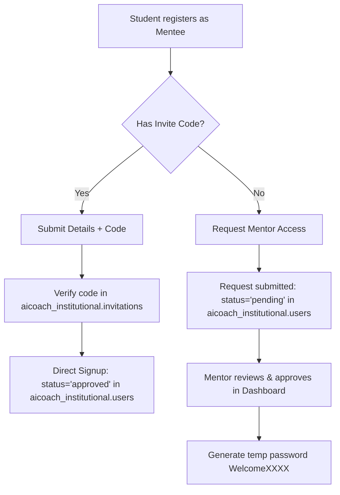

# B2B Institutional Integration Plan (Mentor & Mentee)

This document provides a comprehensive blueprint to integrate the B2B Institutional (Mentor & Mentee) features from the [orchidsai-main](file:///F:/project/aicoach/orchidsai-main) prototype into the main [aicoach](file:///F:/project/aicoach) application. 

The plan strictly satisfies all requirements outlined in [orchidsai-main-answers.md](file:///F:/project/aicoach/md-files/orchidsai-main-answers.md).

---

## 1. Database Separation Design (B2C vs. B2B)

To keep personal (B2C) data isolated from institutional (B2B) data, we will use a separate MongoDB database `aicoach_institutional` for all B2B collections.

```
MongoDB Instances:
├── aicoach (Database for B2C/Personal)
│   ├── users (role: 'student', 'professional')
│   ├── institutions (registered and pending colleges/companies)
│   ├── sessions
│   ├── reports
│   └── otps
│
└── aicoach_institutional (Database for B2B/Institutional)
    ├── users (role: 'mentor', 'mentee')
    ├── invitations (invite links/codes)
    ├── assigned_practices (assigned tasks)
    ├── messages (chats between mentor and mentee)
    ├── sessions (B2B interview sessions)
    ├── reports (B2B coaching reports)
    └── exams (B2B exam records)
```

### 1.1 Database Selection Utility
We will implement [db-selector.ts](file:///F:/project/aicoach/src/lib/db-selector.ts) to transparently route operations based on the active user:

```typescript
import clientPromise from '@/lib/mongodb';
import { ObjectId } from 'mongodb';

export async function getDbForUser(userId: string | ObjectId) {
  const client = await clientPromise;
  const objectId = typeof userId === 'string' ? new ObjectId(userId) : userId;
  
  // Try B2C database first
  const b2cUser = await client.db('aicoach').collection('users').findOne({ _id: objectId });
  if (b2cUser) {
    return {
      db: client.db('aicoach'),
      dbName: 'aicoach',
      user: b2cUser,
      isB2B: false
    };
  }
  
  // Fallback to Institutional database
  const b2bUser = await client.db('aicoach_institutional').collection('users').findOne({ _id: objectId });
  if (b2bUser) {
    return {
      db: client.db('aicoach_institutional'),
      dbName: 'aicoach_institutional',
      user: b2bUser,
      isB2B: true
    };
  }
  
  throw new Error('User not found in any database');
}
```

---

## 2. Signup & Authentication Flows

Mentees can sign up using two methods, integrated into the existing [signup/page.tsx](file:///F:/project/aicoach/src/app/signup/page.tsx) page.



### 2.1 Method A: Invite Code (Instant Signup)
1. **URL Entry:** Student enters via `/signup?code=INST-XXXX-XXXX` or enters the code manually in the registration wizard.
2. **API Logic:** [signup/route.ts](file:///F:/project/aicoach/src/app/api/auth/signup/route.ts) is modified to check for `inviteCode`:
   * Look up the code in `aicoach_institutional.invitations`.
   * If valid and unexpired, create a user directly in `aicoach_institutional.users` with `status: 'approved'`.
   * Enforce password creation (hashed using bcrypt) during registration, avoiding temporary passwords.
   * Increment the invitation `useCount`.

### 2.2 Method B: Request Mentor (Manual Approval Queue)
1. **URL Entry:** Student registers without an invite code by selecting their College from the approved list dropdown in [signup/page.tsx](file:///F:/project/aicoach/src/app/signup/page.tsx).
2. **API Logic:** The legacy `/api/auth/mentee-request` POST handler is modified to save the pending request into `aicoach_institutional.users` with `status: 'pending'`, `role: 'mentee'`.
3. **Approval:** Mentors approve the student in their dashboard. The POST handler `/api/mentor/approve` generates a hashed temporary password (`WelcomeXXXX`) and updates status to `'approved'` in the `aicoach_institutional.users` collection.

---

## 3. Mentor Dashboard Controls & Access Limits

To give mentors control over mentee access, we will implement access constraints.

### 3.1 DB Fields in `aicoach_institutional.users` (Mentee records)
* `status`: `'approved' | 'pending' | 'disabled'` (allows mentor to block account activity).
* `accessLimit`: `{ interviewsCount: number; examsCount: number; expiresAt: Date | null }` (numerical counters set by the mentor).
* `usage`: `{ interviewsCompleted: number; examsCompleted: number }` (incremented on session creation/submission).

### 3.2 Access Limit Enforcements
* **Interview Start:** In [websocket/route.ts](file:///F:/project/aicoach/src/app/api/interview/websocket/route.ts) (or session initialization API), retrieve the student's record using `getDbForUser`. If the account is B2B, check if:
  * `status === 'disabled'` -> Deny access.
  * `usage.interviewsCompleted >= accessLimit.interviewsCount` -> Deny access, show "Limit reached, contact your mentor."
* **Exam Start:** Check same parameters on exam initialization routes.

---

## 4. Superadmin Panel for Approving Institutions

To test the mentor onboarding process, we will replace the superadmin stub with a functional administration dashboard.

### 4.1 UI Design (`src/app/superadmin/page.tsx`)
A frosted glass, neo-glassmorphism portal visible only to administrators:
* **Pending Tab:** Displays cards of registered institutions (loaded from `aicoach.institutions` with `status: 'pending'`). Shows the college location, requested mentor name, work email, and verification documents.
* **Approved Tab:** Displays a list of active institutions with details on their approved date and mentor emails.
* **Actions:** An "Approve" button that triggers a loading state and hits the approve API.

### 4.2 Database Adjustments on Approval
In the superadmin approve API [approve/route.ts](file:///F:/project/aicoach/src/app/api/admin/institutions/approve/route.ts):
* Upon approving an institution, the mentor user is inserted into the `aicoach_institutional` database's `users` collection instead of the B2C database.
* The document structure matches:
  ```json
  {
    "email": "mentor@college.edu",
    "password": "...",
    "role": "mentor",
    "fullName": "Dr. Sarah Miller",
    "collegeName": "Stanford University",
    "status": "approved",
    "createdAt": "2026-06-05T08:00:00Z"
  }
  ```

---

## 5. Routing, UI Integration & Code Reuse

Mentees must reuse the core preparation features (Interviews, Exams, Reports, Recommendations) without duplicating code or interfering with individual B2C users.

### 5.1 Route Mapping
* **Mentor Route:** `/dashboard/mentor/*` (mapped to `/app/dashboard/mentor/*` in `aicoach`).
* **Mentee Route:** `/dashboard/b2b/*` (mapped to `/app/dashboard/b2b/*` in `aicoach`).

### 5.2 Sharing Core Workspaces
The actual live mock interview, exam, and report routes are shared:
* **Interview:** `/interview/[sessionId]`
* **Reports:** `/reports/[reportId]`
* **Exam:** `/exam/[examId]`

Inside these shared route handlers (and supporting API endpoints):
1. Call `getCurrentUser()` to retrieve user context.
2. Call `getDbForUser(user._id)` to retrieve the target database instance (`aicoach` or `aicoach_institutional`).
3. Store and retrieve sessions, raw audio metadata, and generated AI reports from the selected database context.
This guarantees zero collision: B2C data remains in `aicoach` while B2B data remains in `aicoach_institutional`.

---

## 6. Implementation Checklist

### Phase 1: Database Setup
- [ ] Establish `aicoach_institutional` database connection profile.
- [ ] Create `users`, `invitations`, `assigned_practices`, and `messages` collections in `aicoach_institutional`.
- [ ] Build [db-selector.ts](file:///F:/project/aicoach/src/lib/db-selector.ts) and verify user routing works.

### Phase 2: Superadmin & Mentor Creation
- [ ] Build a premium glassmorphic list and approval UI in [superadmin/page.tsx](file:///F:/project/aicoach/src/app/superadmin/page.tsx).
- [ ] Redirect [approve/route.ts](file:///F:/project/aicoach/src/app/api/admin/institutions/approve/route.ts) to write approved mentors to the `aicoach_institutional` database.

### Phase 3: Registration and Dual signup for Mentees
- [ ] Update [signup/page.tsx](file:///F:/project/aicoach/src/app/signup/page.tsx) to support invite codes.
- [ ] Edit [mentee-request/route.ts](file:///F:/project/aicoach/src/app/api/auth/mentee-request/route.ts) to write pending mentees to `aicoach_institutional`.
- [ ] Update [signup/route.ts](file:///F:/project/aicoach/src/app/api/auth/signup/route.ts) to process invite codes, bypass queues, and write directly to `aicoach_institutional`.

### Phase 4: Mentor Dashboard APIs & UI
- [ ] Implement `POST /api/mentor/invite/generate` and `GET /api/mentor/invite`.
- [ ] Implement Notes, Flags, and Practice Assignment endpoints targeting `aicoach_institutional`.
- [ ] Build [mentor/page.tsx](file:///F:/project/aicoach/src/app/dashboard/mentor/page.tsx) and student profile detail screen using custom SVG charts.

### Phase 5: Mentee Dashboard & Limits Enforcement
- [ ] Build [b2b/page.tsx](file:///F:/project/aicoach/src/app/dashboard/b2b/page.tsx) with Assigned Practice and Chat messaging.
- [ ] Implement usage checkers in the interview/exam start endpoints to enforce limits set by the mentor.
