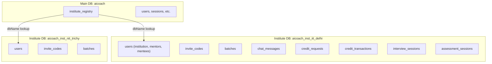
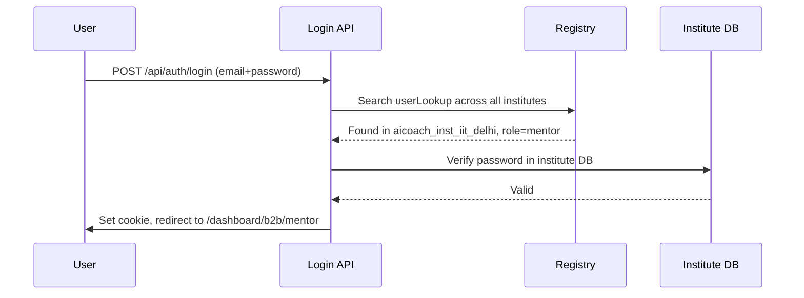

# B2B System Overhaul — Walkthrough

## Architecture Overview

### Key Principle: Complete Database Isolation
Each institute gets its own MongoDB database (`aicoach_inst_{slug}`). The main `aicoach` DB only stores the `institute_registry` collection, which maps institute IDs to their database names and stores metadata (plan, credits, userLookup).

---

## Core Libraries Created

| File | Purpose |
|------|---------|
| [registry.ts](file:///f:/project/aicoach/src/lib/b2b/registry.ts) | Central registry CRUD, user lookup, institute activation/rejection |
| [db-factory.ts](file:///f:/project/aicoach/src/lib/b2b/db-factory.ts) | Creates new institute DBs with all collections + indexes |
| [access.ts](file:///f:/project/aicoach/src/lib/b2b/access.ts) | Credit checks, deductions, allocations, bulk distribution |
| [utils.ts](file:///f:/project/aicoach/src/lib/b2b/utils.ts) | DB name slugification, password gen, invite code gen |

---

## Auth Flow

- **B2C users**: Authenticated against main `aicoach` DB → redirected to `/dashboard/interview`
- **B2B users**: Authenticated via registry userLookup → redirected to `/dashboard/b2b/{institution|mentor}`
- **B2B mentees**: Login via email+password → redirected to existing B2C dashboard with portal filtering

---

## API Routes (26 total)

### Institution APIs (7 routes)
| Route | Method | Purpose |
|-------|--------|---------|
| [/api/b2b/institution/request](file:///f:/project/aicoach/src/app/api/b2b/institution/request/route.ts) | POST | Public registration form |
| [/api/b2b/institution/profile](file:///f:/project/aicoach/src/app/api/b2b/institution/profile/route.ts) | GET | Profile + plan info |
| [/api/b2b/institution/overview](file:///f:/project/aicoach/src/app/api/b2b/institution/overview/route.ts) | GET | Dashboard stats |
| [/api/b2b/institution/mentors](file:///f:/project/aicoach/src/app/api/b2b/institution/mentors/route.ts) | GET/POST | List / create mentors |
| [/api/b2b/institution/mentors/[id]](file:///f:/project/aicoach/src/app/api/b2b/institution/mentors/%5Bid%5D/route.ts) | GET/PATCH/DELETE | Mentor CRUD |
| [/api/b2b/institution/credits/request](file:///f:/project/aicoach/src/app/api/b2b/institution/credits/request/route.ts) | POST | Request more credits |
| [/api/b2b/institution/mentor-overview/[id]](file:///f:/project/aicoach/src/app/api/b2b/institution/mentor-overview/%5Bid%5D/route.ts) | GET | Track mentor's performance |

### Mentor APIs (11 routes)
| Route | Method | Purpose |
|-------|--------|---------|
| [/api/b2b/mentor/profile](file:///f:/project/aicoach/src/app/api/b2b/mentor/profile/route.ts) | GET | Mentor profile |
| [/api/b2b/mentor/overview](file:///f:/project/aicoach/src/app/api/b2b/mentor/overview/route.ts) | GET | Dashboard stats |
| [/api/b2b/mentor/mentees](file:///f:/project/aicoach/src/app/api/b2b/mentor/mentees/route.ts) | GET | List mentees |
| [/api/b2b/mentor/mentees/[id]](file:///f:/project/aicoach/src/app/api/b2b/mentor/mentees/%5Bid%5D/route.ts) | GET/PATCH/DELETE | Mentee CRUD |
| [/api/b2b/mentor/mentees/[id]/track](file:///f:/project/aicoach/src/app/api/b2b/mentor/mentees/%5Bid%5D/track/route.ts) | GET | Track mentee progress |
| [/api/b2b/mentor/invite](file:///f:/project/aicoach/src/app/api/b2b/mentor/invite/route.ts) | GET/POST | Invite code management |
| [/api/b2b/mentor/batches](file:///f:/project/aicoach/src/app/api/b2b/mentor/batches/route.ts) | GET/POST | Batch management |
| [/api/b2b/mentor/batches/[id]/assign](file:///f:/project/aicoach/src/app/api/b2b/mentor/batches/%5Bid%5D/assign/route.ts) | POST | Assign mentees to batch |
| [/api/b2b/mentor/credits/distribute](file:///f:/project/aicoach/src/app/api/b2b/mentor/credits/distribute/route.ts) | POST | Equal / manual distribution |
| [/api/b2b/mentor/credits/request](file:///f:/project/aicoach/src/app/api/b2b/mentor/credits/request/route.ts) | GET/POST | Request credits from institution |
| [/api/b2b/mentor/chat](file:///f:/project/aicoach/src/app/api/b2b/mentor/chat/route.ts) | GET/POST | Chat with mentees |

### Mentee APIs (3 routes)
| Route | Method | Purpose |
|-------|--------|---------|
| [/api/b2b/mentee/join](file:///f:/project/aicoach/src/app/api/b2b/mentee/join/route.ts) | POST | Join via invite code |
| [/api/b2b/mentee/mentor](file:///f:/project/aicoach/src/app/api/b2b/mentee/mentor/route.ts) | GET | View assigned mentor |
| [/api/b2b/mentee/chat](file:///f:/project/aicoach/src/app/api/b2b/mentee/chat/route.ts) | GET/POST | Chat with mentor |

### Admin APIs (5 routes)
| Route | Method | Purpose |
|-------|--------|---------|
| [/api/admin/b2b/requests](file:///f:/project/aicoach/src/app/api/admin/b2b/requests/route.ts) | GET | List pending + active |
| [/api/admin/b2b/activate](file:///f:/project/aicoach/src/app/api/admin/b2b/activate/route.ts) | POST | Activate institute |
| [/api/admin/b2b/reject](file:///f:/project/aicoach/src/app/api/admin/b2b/reject/route.ts) | POST | Reject request |
| [/api/admin/b2b/institutes](file:///f:/project/aicoach/src/app/api/admin/b2b/institutes/route.ts) | GET | List active institutes |
| [/api/admin/b2b/institutes/[id]/credits](file:///f:/project/aicoach/src/app/api/admin/b2b/institutes/%5Bid%5D/credits/route.ts) | POST | Add credits to institute |

---

## Dashboard Pages (12 + 2 public pages)

### Institution Dashboard (`/dashboard/b2b/institution`)
- **Overview**: Stats grid (mentors, mentees, credits, expiry) + recent activity
- **Mentors**: Create mentors with auto-generated credentials, list with credit/status info
- **Credits**: Usage visualization + request more credits from admin
- **Profile**: Institution details display

### Mentor Dashboard (`/dashboard/b2b/mentor`)
- **Overview**: Stats grid (mentees, batches, credits, portals)
- **Mentees**: List all mentees with batch/credits/status
- **Invite**: Generate invite codes + copy-to-clipboard
- **Batches**: Create/list batches with mentee counts
- **Credits**: 3-tab interface (distribute, request, history)
- **Chat**: Split-panel chat UI with mentee list
- **Profile**: Mentor details display

### Public Pages
- [/join](file:///f:/project/aicoach/src/app/join/page.tsx): Mentee join via invite code (2-step form)
- [/plans/business](file:///f:/project/aicoach/src/app/plans/business/page.tsx): Business purchase registration (2-step form)

---

## Verification

- ✅ `npm run build` passes with all 78 routes compiled
- ✅ No stale `aicoach_institutional` references in source code
- ✅ B2C flow unaffected (student/professional login, signup, dashboard)
- ✅ Complete B2B isolation: separate databases per institute
- ✅ Credit system: 1 credit = 1 session, atomic deduction, audit trail
